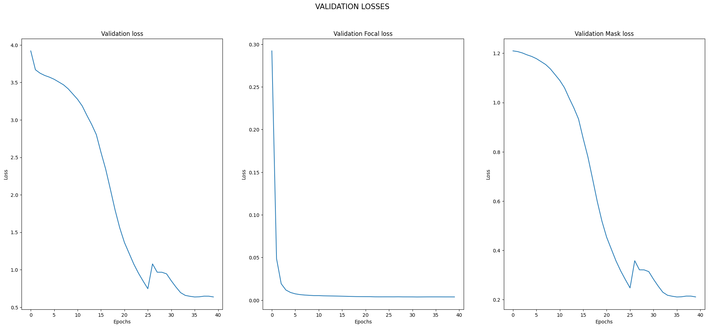

# Instance Segmentation using SOLO

This repository contains the implementation of the instance segmentation model using the SOLO algorithm. The model leverages Pytorch Lightning to enhance maintainability and scalability of the training process, while focusing on the efficiency and effectiveness of segmenting objects in images.

## Table of Contents
- [Overview](#overview)
- [Pipeline](#pipeline)
- [Key Concepts Used](#key-concepts-used)
- [Edge Cases](#edge-cases)
- [Scope of Improvements](#scope-of-improvements)
- [Dependencies](#dependencies)
- [Results](#results)
- [License](#license)
- [Contact](#contact)

## Overview
The project addresses the problem of segmenting and identifying individual objects within an image, regardless of the object's class. This is particularly challenging in cluttered scenes where objects might overlap or be densely packed. Instance segmentation is a crucial task in computer vision that has applications across various domains, including autonomous vehicles, robotics, and medical imaging. The SOLO model aims to simplify and enhance the instance segmentation process by using a direct prediction strategy that eliminates the need for bounding box detection or object proposals as in two-stage methods, potentially improving both accuracy and inference speed.

<!-- ### Objectives
- **Model Implementation**: To implement the SOLO algorithm from scratch using PyTorch Lightning, ensuring that the model architecture aligns with the requirements for effective instance segmentation.
- **Training Efficiency**: To leverage Pytorch Lightning's built-in functionalities for efficient training, including multi-GPU support, mixed-precision training, and easy-to-use abstractions for model checkpoints, logging, and experiment tracking.
- **Dataset Utilization**: To apply the model to a chosen dataset and tailor the SOLO algorithm to work effectively with the data specifics, such as object sizes, image resolution, and domain-specific features.
- **Evaluation and Benchmarking**: To evaluate the model's performance against established metrics for instance segmentation, such as mean Average Precision (mAP), and to compare its results with those of other state-of-the-art models.
- **Real-world Application**: To demonstrate the model's practicality by deploying it in a real-world scenario where instance segmentation can provide value, such as autonomous driving, medical image analysis, or agricultural monitoring. -->

## Pipeline
The project follows these steps:
1. **Data Preparation**
   - **Dataset Acquisition**: Collecting a dataset suitable for instance segmentation tasks.
   - **Preprocessing**: Applying transformations such as resizing, normalization, augmentation to the images and annotations to prepare for training.

2. **Model Development**
   - **Architecture Design**: Designing the SOLO model architecture including the backbone network, FPN (Feature Pyramid Network), and segmentation head.
   - **Pytorch Lightning Integration**: Wrapping the model, data loaders, and optimizers into Pytorch Lightning Modules for streamlined training and validation loops.

3. **Training and Validation**
   - **Training Loop**: Utilizing Pytorch Lightning's Trainer class to train the model on the prepared dataset, managing batches, epochs, and learning rate schedules.
   - **Validation Loop**: Periodically validating the model on a held-out dataset to monitor performance metrics like mAP (mean Average Precision).

4. **Evaluation**
   - **Testing**: After training, testing the model on a separate test set to evaluate its generalization capabilities.
   - **Metrics Computation**: Calculating instance segmentation metrics such as mAP, IoU (Intersection over Union), and Precision/Recall curves.

5. **Optimization and Tuning**
   - **Hyperparameter Tuning**: Adjusting hyperparameters such as learning rate, batch size, and network depth for optimal performance.
   - **Model Refinement**: Refining the model based on evaluation results, which may involve architecture changes or additional data augmentation strategies.

<!-- 6. **Deployment**
   - **Model Export**: Exporting the trained model for inference.
   - **Inference Pipeline**: Setting up an inference pipeline to process new images and output instance segmentation results.

7. **Monitoring and Maintenance**
   - **Performance Monitoring**: Continuously monitoring the model's performance in production to ensure it maintains accuracy over time.
   - **Model Updating**: Periodically retraining or fine-tuning the model with new data to adapt to changes in the input distribution. -->

## Key Concepts Used
- Feature Pyramid Networks
- Loss Functions and Optimization Algorithms
- Non-Maximum Suppression (NMS)
- Intersection over Union (IoU)
- Data Augmentation
- Libraries: Pytorch, Pytorch Lightning, Torchvision, CUDA, NumPy, OpenCV, Matplotlib

## Edge Cases
1. **Small Object Detection**: Model might struggle with detecting small objects because the features might be too fine-grained for the network to detect.
    - Enhancing the feature extractor or incorporating modules designed to capture small object features can help.
2. **Overlapping Objects**: In densely packed scenes, the model might have difficulty distinguishing between closely overlapping objects.
    - Refine the post-processing steps, possibly incorporating better non-maximum suppression techniques or additional logic to handle overlaps.
3. **High Aspect Ratio Objects**: Objects with extreme aspect ratios might be challenging due to the grid nature of the SOLO model's segmentation approach.
    - Custom data augmentation strategies that alter the aspect ratio during training might improve performance on such objects.
4. **Background Complexity**: Complex backgrounds can lead to false positives or incorrect segmentations.
    - Incorporating background subtraction techniques or additional training on complex backgrounds could mitigate this.
5. **Class Imbalance**: If some object classes are underrepresented in the training data, the model might not learn to detect them effectively.
    - Techniques such as oversampling the underrepresented classes or using class-balanced loss functions can be used.
6. **Real-time Processing**: The computational complexity of the model might not allow for real-time processing on standard hardware.
    - Model optimization and simplification, quantization, or model distillation could be considered to improve inference times.

<!-- Small Object Detection: SOLO may struggle with detecting very small objects because the features might be too fine-grained for the network to detect.
Addressing: Enhancing the feature extractor or incorporating modules designed to capture small object features can help. Documentation should include notes on the expected object size range.
Overlapping Objects: In densely packed scenes, the SOLO model might have difficulty distinguishing between closely overlapping objects.
Addressing: Refine the post-processing steps, possibly incorporating better non-maximum suppression techniques or additional logic to handle overlaps. This would be documented in the code where post-processing steps are defined.
High Aspect Ratio Objects: Objects with extreme aspect ratios might be challenging due to the grid nature of the SOLO model's segmentation approach.
Addressing: Custom data augmentation strategies that alter the aspect ratio during training might improve performance on such objects. This should be noted in the data augmentation part of the code.
Variable Lighting Conditions: Like many vision models, performance can degrade under poor or variable lighting.
Addressing: Include diverse lighting conditions in the training data and possibly use photometric augmentation. Comments in the augmentation pipeline should explain the choice of augmentations.
Background Complexity: Complex backgrounds can lead to false positives or incorrect segmentations.
Addressing: Incorporating background subtraction techniques or additional training on complex backgrounds could mitigate this. The model's sensitivity to background complexity should be part of the model evaluation documentation.
Class Imbalance: If some object classes are underrepresented in the training data, the model might not learn to detect them effectively.
Addressing: Techniques such as oversampling the underrepresented classes or using class-balanced loss functions can be used. The strategy employed should be documented in the data loader or training loop code comments.
Real-time Processing: The computational complexity of the model might not allow for real-time processing on standard hardware.
Addressing: Model optimization and simplification, quantization, or model distillation could be considered to improve inference times, and this should be reflected in the documentation if implemented.
Domain Shift: The model might not generalize well to new domains that differ significantly from the training data.
Addressing: Domain adaptation techniques or fine-tuning the model on a small set of target domain data can help. This should be documented in the sections of the code dealing with model evaluation or adaptation. -->

## Scope of Improvements
Potential improvements include model architecture refinements, real-time inference, transfer learning, advanced data augmentation, and more.

## Dependencies
To run a project like the SOLO model using Pytorch Lightning, you would typically need the following external libraries, frameworks, and packages:

1. **PyTorch**: The core framework for building and training neural networks.
2. **Pytorch Lightning**: A high-level interface for PyTorch that simplifies code complexity.
3. **Torchvision**: Provides common datasets and architectures for computer vision.
4. **NumPy**: A fundamental package for scientific computing with Python.
5. **OpenCV**: Optional, for image processing tasks outside of what's available in PyTorch/Torchvision.
6. **Matplotlib**: For creating visualizations, especially during the debugging process.
7. **CUDA Toolkit**: If you're planning to train the model on Nvidia GPUs.

## Results
Showcase the results achieved by the model, including performance metrics and visualizations of the instance segmentation.

| Description | Image |
|-------------|-------|
| Image 1     |  |
| Image 2     |  |
| Image 3     |  |
| Image 4     |  |
| Image 5     |  |

## License

This project is licensed under the [MIT License](LICENSE).

## Contact

For any issues, queries, or feedback, please contact: [ayush.goel2427@gmail.com].